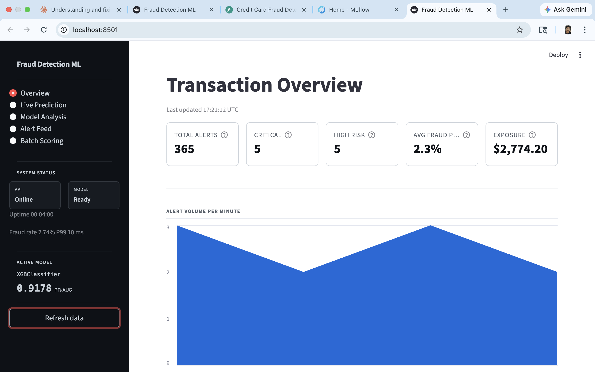

<div align="center">

# Fraud Detection System — ML

**Production-grade credit card fraud detection built end-to-end.**
From raw transaction data → live inference API → real-time dashboard → drift monitoring → automated retraining.

<br/>

[](https://python.org)
[](https://xgboost.ai)
[](https://fastapi.tiangolo.com)
[](https://streamlit.io)
[](https://mlflow.org)
[](./tests)
[](./Dockerfile)

</div>

---

## Key Results

| Metric | Value |
|:---|:---:|
| **XGBoost PR-AUC** | `0.870` |
| **XGBoost ROC-AUC** | `0.978` |
| **Recall** | `85.4%` |
| **Precision** | `88.2%` |
| **F1 Score** | `86.8%` |
| **Fraud Caught** | `~$39,200` |
| **Net ROI** | `~3,400%` |
| **Test Suite** | `39 / 39 ✅` |

> **Why PR-AUC and not accuracy?** A model that classifies every transaction as legitimate
> achieves **99.83% accuracy** while catching **zero fraud**.
> PR-AUC measures the precision-recall tradeoff on the minority class — the correct metric for imbalanced datasets.

---

## Live Dashboard

> Click the image below to open the live Streamlit dashboard →

<div align="center" style="border: 2px solid #ccc; padding: 10px; border-radius: 10px;">

[](https://fraud-detection-988itbtnyczqkfo3fqqk8e.streamlit.app/)


</div>

---

## Live Working — Fraud Detection Pages

Three core views that power the detection system:

<br/>

<table>
  <tr>
    <td width="33%" align="center">
      
      <br/><br/>
      <b> Dashboard Overview</b><br/>
      Total alerts · Critical & high-risk counts · Average fraud probability · Financial exposure — all in real time.
    </td>
    <td width="33%" align="center">
      
      <br/><br/>
      <b>📡 Live Prediction</b><br/>
      Score any transaction manually against the model. Returns probability gauge, risk tier, and SHAP explanation.
    </td>
    <td width="33%" align="center">
      
      <br/><br/>
      <b> Machine Learning Analysis</b><br/>
      PR curves · ROC curves · Confusion matrix · SHAP feature importance plots.
    </td>
  </tr>
</table>

---

##  Dashboard — All Screen References

All dashboard pages shown below, arranged two per row:

<br/>

<table>
  <tr>
    <td width="50%" align="center">
      
      <br/><br/>
      <b>Screenshot 1 — Alert Feed</b><br/>
      Streams live fraud alerts as the simulator runs. Every flagged transaction appears here in real time with risk tier and probability.
    </td>
    <td width="50%" align="center">
      
      <br/><br/>
      <b>Screenshot 2 — Batch Scoring</b><br/>
      Upload a CSV and get predictions for up to 10,000 rows. Results returned with risk tier per transaction.
    </td>
  </tr>
  <tr><td colspan="2"><br/></td></tr>
  <tr>
    <td width="50%" align="center">
      
      <br/><br/>
      <b>Screenshot 3 — Drift Monitor</b><br/>
      Compares live feature distributions against the training baseline using PSI + KS test on every feature.
    </td>
    <td width="50%" align="center">
      
      <br/><br/>
      <b>Screenshot 4 — Rolling Metrics</b><br/>
      5-minute rolling windows — fraud rate, throughput, error rate, and P50 / P95 / P99 latency.
    </td>
  </tr>
  <tr><td colspan="2"><br/></td></tr>
  <tr>
    <td width="50%" align="center">
      
      <br/><br/>
      <b>Screenshot 5 — SHAP Explainability</b><br/>
      Per-transaction feature contributions. Explains exactly why the model flagged a transaction.
    </td>
    <td width="50%" align="center">
      
      <br/><br/>
      <b>Screenshot 6 — Business Impact</b><br/>
      Live cost/benefit estimates — fraud caught, fraud missed, review cost, and net ROI at the active threshold.
    </td>
  </tr>
  <tr><td colspan="2"><br/></td></tr>
  <tr>
    <td width="50%" align="center">
      
      <br/><br/>
      <b>Screenshot 7 — Model Health</b><br/>
      Live model health status — prediction count, uptime, scaler and model load confirmation.
    </td>
    <td width="50%" align="center">
      <br/><br/><br/><br/>
      <b> Dataset</b><br/>
      <a href="https://www.kaggle.com/datasets/mlg-ulb/creditcardfraud">Credit Card Fraud Detection</a> by ULB Machine Learning Group.<br/>
      284,807 transactions · 492 fraud cases · 0.172% fraud rate.<br/>
      Download from Kaggle → place at <code>data/raw/creditcard.csv</code>
    </td>
  </tr>
</table>

---

## Why This Is Production-Grade

These are the engineering decisions that separate a real deployed system from a notebook experiment:

**① No Training-Serving Skew**
The scaler is fitted **only on the training set**, saved to disk, and loaded at inference time. If the scaler sees test data during fitting, the model learns a wrong representation and fails silently — no error message, just wrong predictions.

**② Feature Column Order Saved**
Scikit-learn models are sensitive to input column order. Python dict iteration order is not guaranteed consistent across environments. The column list is saved explicitly alongside the model, eliminating this entire class of silent bug.

**③ SMOTE Applied After the Split — Not Before**
Oversampling is applied in Phase 4, strictly on the training split. Applying SMOTE before splitting leaks synthetic samples into the test set — every metric inflates, the real model degrades.

**④ Threshold Calibrated via Youden's J Statistic**
Threshold set at **0.40**, not the default 0.50. Calibrated on the validation set, never the test set. A missed fraud costs ~$80. A false positive costs ~$5. A lower threshold is the correct business decision.

**⑤ Dual Drift Detection — PSI + KS**
PSI (Population Stability Index) is the industry standard in credit risk monitoring.
KS test catches distribution shifts PSI misses when changes fall within a single bin boundary.
Both run on every drift check.

---

## Model Comparison

| Model | PR-AUC | ROC-AUC | Recall | Precision | F1 |
|:---|:---:|:---:|:---:|:---:|:---:|
| ✅ **XGBoost** *(active)* | **0.870** | **0.978** | **0.854** | **0.882** | **0.868** |
| Random Forest | 0.841 | 0.971 | 0.826 | 0.863 | 0.844 |
| Decision Tree | 0.631 | 0.918 | 0.784 | 0.607 | 0.684 |

XGBoost is the active model — loaded at API startup and used for all predictions.

---

## Business Impact

*Threshold: 0.40 · Avg fraud loss: $80 · False positive review cost: $5*

| Metric | Value |
|:---|:---:|
| Fraud Caught | **~$39,200** |
| Fraud Missed | ~$6,800 |
| Review Cost | ~$1,100 |
| **Net Benefit** | **~$38,100** |
| **ROI** | **~3,400%** |

---

## System Architecture

```
╔══════════════════════════════════╗    ╔══════════════════════════════════╗
║         OFFLINE TRAINING         ║    ║          ONLINE SERVING          ║
╠══════════════════════════════════╣    ╠══════════════════════════════════╣
║                                  ║    ║                                  ║
║  creditcard.csv                  ║    ║  HTTP client / payment network   ║
║         │                        ║    ║           │                      ║
║  loader.py · preprocessing.py    ║    ║      POST /predict               ║
║         │                        ║    ║           │                      ║
║  feature_engineering.py          ║    ║  api/main.py  (FastAPI)          ║
║  resampling.py  ← SMOTE only     ║    ║           │                      ║
║         │       on train split   ║    ║  inference/predictor.py          ║
║  train_model.py                  ║    ║           │                      ║
║  tuning.py  ← Optuna             ║    ║  xgboost_model.pkl               ║
║         │                        ║    ║  scaler.pkl                      ║
║  MLflow experiment log           ║    ║  feature_names.pkl               ║
║  models/*.pkl ◄──────────────────╬────╬───────────┘                      ║
║  drift_baseline.json             ║    ║  model_monitor.py                ║
║  reports/figures/*.png           ║    ║  dashboard/app.py  (Streamlit)   ║
║                                  ║    ║                                  ║
╚══════════════════════════════════╝    ╚══════════════════════════════════╝
```

---

##  API Reference

**Base URL:** `http://localhost:8000` &nbsp;|&nbsp; **Swagger UI:** `http://localhost:8000/docs`

| Method | Endpoint | Description |
|:---:|:---|:---|
| `GET` | `/health` | Liveness check — live fraud rate + P99 latency |
| `GET` | `/info` | Model name, threshold, feature count, training metadata |
| `GET` | `/metrics` | Operational metrics — JSON or Prometheus format |
| `POST` | `/predict` | Score a single transaction. Add `?explain=true` for SHAP values |
| `POST` | `/predict/batch` | Score a CSV upload up to 10,000 rows |

**Risk Tiers:**

| Tier | Probability | Action |
|:---|:---:|:---|
| 🟢 **LOW** | `< 15%` | Allow |
| 🟡 **MEDIUM** | `15% – 40%` | Soft review |
| 🔴 **HIGH** | `40% – 70%` | Manual review |
| 🟣 **CRITICAL** | `> 70%` | Auto-block |

**Example:**

```bash
curl -s -X POST http://localhost:8000/predict \
  -H "Content-Type: application/json" \
  -d '{
    "V1": -1.3598, "V2": -0.0728, "V3": 2.5364, "V4": 1.3782,
    "Amount": 149.62, "Time": 406.0
  }'
```

```json
{
  "prediction": "legitimate",
  "probability": 0.032,
  "risk_tier": "LOW",
  "threshold_used": 0.40,
  "message": "Transaction appears normal. No action required."
}
```

---

## Setup & Running

**Requirements:** Python 3.10+

```bash
# Clone
git clone https://github.com/RagannagariSiva/fraud-detection.git
cd fraud-detection

# Virtual environment
python3 -m venv venv
source venv/bin/activate

# Install
pip install --upgrade pip
pip install -r requirements.txt

# Train all 11 pipeline phases (~2 min on CPU)
python main.py

# Start inference API  →  http://localhost:8000/docs
uvicorn api.main:app --host 0.0.0.0 --port 8000

# Start dashboard  →  http://localhost:8501
streamlit run dashboard/app.py

# Run transaction simulator
python simulation/real_time_transactions.py --tps 2 --duration 0 --fraud-rate 0.05

# Run all 39 tests
pytest tests/ -v
```

**Docker — run everything at once:**

```bash
docker compose run --rm train
docker compose up api dashboard mlflow
```

**Make shortcuts:**

```bash
make train       # Train full pipeline
make api         # Start inference API
make dashboard   # Start Streamlit dashboard
make simulate    # Run transaction simulator
make test        # Run test suite with coverage
make retrain     # Drift-gated automated retraining
make docker-up   # Start all services in Docker
make help        # Full command reference
```

---

## Project Structure

```
fraud-detection/
│
├── src/
│   ├── data/               # Loading, cleaning, scaling, stratified splits
│   ├── features/           # Feature engineering + SMOTE resampling
│   ├── training/           # 11-phase pipeline, MLflow logging, Optuna tuning
│   ├── inference/          # FraudPredictor + Pydantic schemas
│   ├── models/             # Evaluation: ROC/PR curves, confusion matrix
│   └── monitoring/         # Drift detection (PSI + KS) + rolling health metrics
│
├── api/                    # FastAPI — all prediction endpoints
├── dashboard/              # Streamlit — 5-page analytics interface
├── monitoring/             # Fraud alert dispatcher + JSONL event log
├── simulation/             # Synthetic transaction stream for load testing
├── scripts/
│   ├── retrain.py          # Drift-gated retraining + model promotion
│   └── evaluate.py         # Standalone evaluation on any model + CSV
│
├── tests/                  # 39 unit + integration tests
├── notebooks/              # EDA + model comparison
├── config/config.yaml      # Single config file for all components
├── Makefile                # All operations as make targets
├── Dockerfile              # Multi-stage production image
└── docker-compose.yml      # Full stack: API + Dashboard + MLflow + Simulator
```

---

## Tech Stack

| Layer | Technologies |
|:---|:---|
| **ML & Data** | Python 3.10+, scikit-learn, XGBoost, imbalanced-learn, scipy, SHAP |
| **Experiment Tracking** | MLflow, Optuna |
| **API** | FastAPI, Pydantic v2, Uvicorn |
| **Dashboard** | Streamlit |
| **Testing & Linting** | pytest, ruff |
| **Infrastructure** | Docker, docker-compose |

---

<div align="center">

Built by [Ragannagari Siva](https://github.com/RagannagariSiva) &nbsp;·&nbsp; [GitHub Repository](https://github.com/RagannagariSiva/fraud-detection)

*Production-grade ML · End-to-end · XGBoost · FastAPI · Streamlit · MLflow*

</div>
